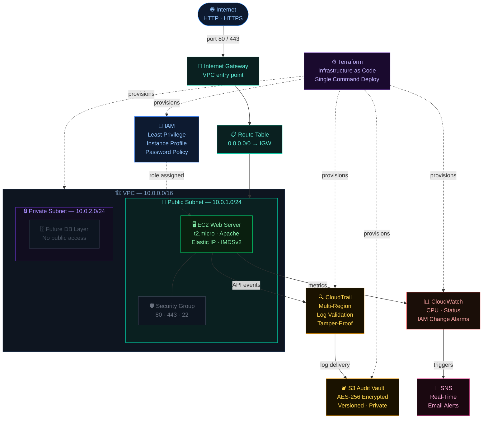

# 🔒 Terraform AWS Security Framework


---

## What is this?

This project provisions a complete, security-hardened AWS environment using Terraform. Every resource — from IAM roles to CloudWatch alarms — is defined as code, versioned, and deployable with a single command.

It covers six layers of cloud security: identity, storage, logging, networking, compute, and monitoring. No clicking around the console. No forgetting a step. Just `terraform apply` and everything is built exactly the same way, every time.

---

## 🌐 Live Demo

**👉 http://52.72.133.29**

---

## 📌 What was built

| Layer | Service | What it does |
|---|---|---|
| 🔐 Identity | IAM | Locks down who can do what — least privilege everywhere |
| 🪣 Storage | S3 | Private, encrypted vault that stores every audit log |
| 🔍 Logging | CloudTrail | Records every single API call made in the account |
| 🌐 Networking | VPC | Custom isolated network — nothing gets in without permission |
| 🖥️ Compute | EC2 | Hardened web server running Apache with a static IP |
| 📊 Monitoring | CloudWatch + SNS | Watches for threats and sends email alerts in real time |

---

## 🏗️ Architecture



---

## ⚙️ Why Terraform?

I originally built this same framework manually using the AWS CLI. It worked, but it took hundreds of commands, was easy to get wrong, and hard to rebuild from scratch.

Terraform solves all of that. You describe the infrastructure you want, and it figures out how to build it. If something goes wrong, you fix the code and reapply. When you're done, one command tears everything down cleanly.

| AWS CLI Version | Terraform Version |
|---|---|
| 100+ manual commands | `terraform apply` |
| Easy to make mistakes | Same result every time |
| Hard to share or reproduce | Clone and deploy anywhere |
| No record of what exists | State file tracks everything |
| Manual teardown | `terraform destroy` |

---

## 🚀 How it was built — Phase by Phase

### Phase 1 — IAM
**Module:** `modules/iam/`

The first thing I built was identity — before any server, any network, anything. This is intentional. In cloud environments, IAM is your first and most important line of defense.

What was configured:
- A strong account-wide password policy (14+ characters, symbols, expiry every 90 days)
- An EC2 instance role with only the permissions it actually needs — CloudWatch and SSM
- No admin users, no wildcard permissions, no shared credentials

The reason IAM comes first is simple: if your identity layer is weak, nothing else you build matters.

---

### Phase 2 — S3 Audit Vault
**Module:** `modules/s3/`

Before any logging can happen, there needs to be a safe place to store the logs. I built a dedicated S3 bucket with three non-negotiables: encryption, versioning, and zero public access.

What was configured:
- AES-256 encryption at rest — logs cannot be read even if someone gets bucket access
- Versioning enabled — even if someone deletes a log, the previous version is preserved
- Public access fully blocked at bucket level
- A resource-based policy that allows only the CloudTrail service to write — nothing else

The goal was simple: make it physically difficult to tamper with audit evidence.

---

### Phase 3 — CloudTrail
**Module:** `modules/cloudtrail/`

With the vault ready, I turned on logging. CloudTrail captures every API call made in the AWS account — whether it comes from the console, the CLI, or an attacker.

What was configured:
- Multi-region trail — covers all AWS regions, not just the one being used
- Global service events enabled — captures IAM and STS activity which are account-wide
- Log file validation — every log file gets a hash that proves it hasn't been modified

The multi-region part is often overlooked. Attackers know that most people only monitor their primary region. A multi-region trail removes that blind spot.

---

### Phase 4 — VPC
**Module:** `modules/vpc/`

I built the network from scratch — no default VPC, no pre-existing resources. Everything was intentional.

What was configured:
- A VPC with CIDR `10.0.0.0/16` — 65,536 private IP addresses
- A public subnet for the web server — internet-facing, controlled by security groups
- A private subnet reserved for a future database layer — completely isolated from the internet
- An internet gateway and route table directing only necessary traffic
- Two security groups — one for the web server (ports 80, 443, 22), one for a bastion host (port 22 only)

The private subnet exists even though nothing lives there yet. This is intentional — building with future expansion in mind means you're not scrambling to restructure the network later.

---

### Phase 5 — EC2 Web Server
**Module:** `modules/ec2/`

The web server was the most hardening-intensive piece. A publicly accessible server is the highest-risk component in this architecture.

What was configured:
- Amazon Linux 2023 on a t2.micro (free tier eligible)
- Apache installed automatically via a User Data script on first boot — no manual SSH required
- An Elastic IP for a consistent public address that survives instance restarts
- The IAM instance profile attached — the server can talk to CloudWatch and SSM without a single hardcoded credential
- IMDSv2 enforced — this blocks a class of attacks called SSRF, where a compromised application tries to read AWS credentials from the metadata endpoint

**Live:** http://52.72.133.29

---

### Phase 6 — CloudWatch + SNS
**Module:** `modules/cloudwatch/`

The final layer is visibility. It is not enough to build secure infrastructure — you need to know immediately when something goes wrong.

What was configured:
- A CPU alarm that fires if the instance stays above 80% for 10 minutes — this catches crypto miners and DDoS attacks
- A status check alarm that fires if the instance fails its health check — catches hardware failures and crashes
- An IAM policy change alarm that fires the moment any permission is modified — this is the most important one, because privilege escalation is how most attacks escalate
- All alarms connected to an SNS topic that sends an email instantly

---

## 🛡️ Security Simulation

After building, I tested. Three real-world attack scenarios were run against this deployment to verify that every control actually works:

| Scenario | Result | Caught By |
|---|---|---|
| Unauthorized API Access | Blocked + Alerted | IAM · CloudTrail · CloudWatch · SNS |
| SSH Brute Force | Blocked | Key Pair Auth · Security Group |
| Log Tampering | Blocked + Preserved | S3 Policy · Versioning · CloudTrail |

📄 [Read the full Security Simulation Report](SECURITY_SIMULATION.md)

---

## 🔐 Key Security Decisions

These are the decisions that matter — and why they were made:

**IAM before everything else** — Identity is the perimeter in cloud. If IAM is weak, a compromised account can undo every other control.

**Multi-region CloudTrail** — Attackers commonly spin up resources in regions that aren't being monitored. A multi-region trail closes that gap.

**Log file validation** — This creates a cryptographic hash for every log file. If a log is modified after delivery, the hash won't match and you'll know.

**IMDSv2 enforcement** — The instance metadata service is a common target for SSRF attacks. IMDSv2 requires a session token, which blocks unauthenticated requests entirely.

**S3 versioning** — Even with the strictest bucket policy, an attacker who somehow gets write access cannot permanently destroy logs. Versioning preserves every previous version.

**Terraform modules** — Each service is its own module. This makes the code reusable, easier to audit, and easier to update without breaking everything else.

---

## 💰 Cost Breakdown

This entire deployment runs for almost nothing:

| Service | Monthly Cost |
|---|---|
| EC2 t2.micro | $0.00 (free tier) |
| S3 Audit Vault | ~$0.02 |
| CloudTrail | $0.00 (first trail is free) |
| Elastic IP | $0.00 (attached to a running instance) |
| CloudWatch | $0.00 (3 alarms, 10 are free) |
| SNS | $0.00 (under 1,000 emails per month) |
| VPC / IGW / Subnets | $0.00 (always free) |
| **Total** | **~$0.02/month** |

---

## 🛠️ Deploy it yourself

```bash
# Clone the repository
git clone https://github.com/johntay379-hub/terraform-aws-security-framework.git
cd terraform-aws-security-framework

# Generate an SSH key pair for EC2 access
ssh-keygen -t rsa -b 4096 -f ~/.ssh/john-security-key -N ""

# Set up your AWS credentials
aws configure

# Download the AWS provider plugin
terraform init

# See exactly what Terraform will create before touching anything
terraform plan

# Build everything
terraform apply

# When you are done, clean up with one command
terraform destroy
```

You will need Terraform 1.0 or higher, the AWS CLI configured, and an IAM user with sufficient permissions.

---

## 📁 Project Structure

```
terraform-aws-security-framework/
├── main.tf                   # Connects all modules together
├── variables.tf              # All configurable values in one place
├── outputs.tf                # What gets printed after deployment
├── providers.tf              # AWS provider and version config
├── .gitignore                # Keeps secrets and large files out of git
├── modules/
│   ├── iam/                  # Phase 1 — Identity & access
│   ├── s3/                   # Phase 2 — Audit log storage
│   ├── cloudtrail/           # Phase 3 — API activity logging
│   ├── vpc/                  # Phase 4 — Network isolation
│   ├── ec2/                  # Phase 5 — Hardened web server
│   └── cloudwatch/           # Phase 6 — Monitoring and alerting
├── SECURITY_SIMULATION.md    # Attack scenarios and outcomes
├── README.md                 # You are here
└── screenshots/              # Console and CLI proof of deployment
```

---

## 📸 Screenshots

All screenshots are in the `/screenshots` folder — AWS console views and Terraform terminal output showing every service deployed and verified.

---

## 👨‍💻 Author

**John** — AWS Cloud Security Engineer

Built and deployed in May 2026, region us-east-1, on Ubuntu Linux using Terraform.

> This started as a manual AWS CLI project. Rebuilding it in Terraform was the next logical step — same security principles, better engineering practice.
